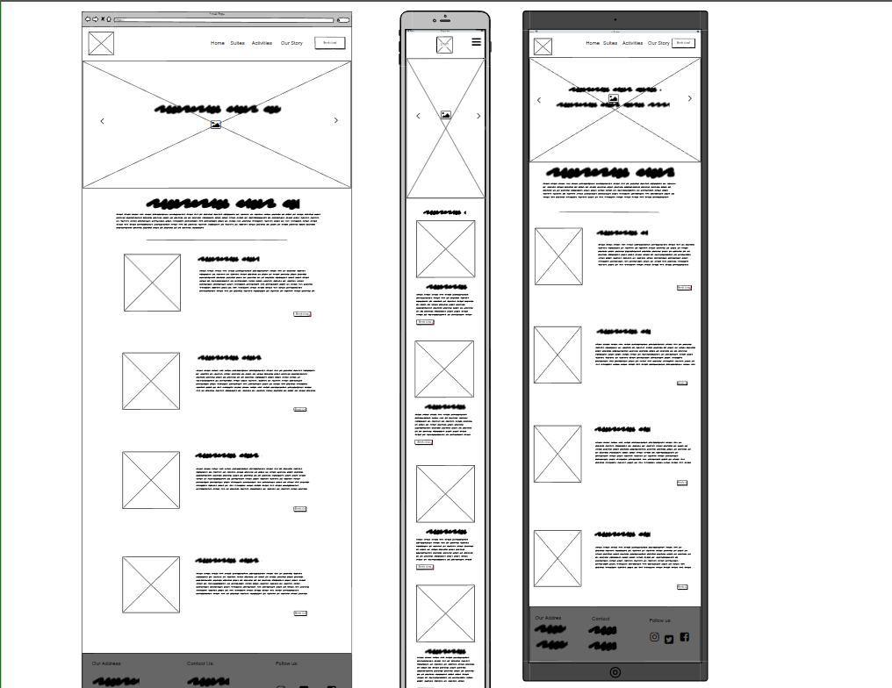
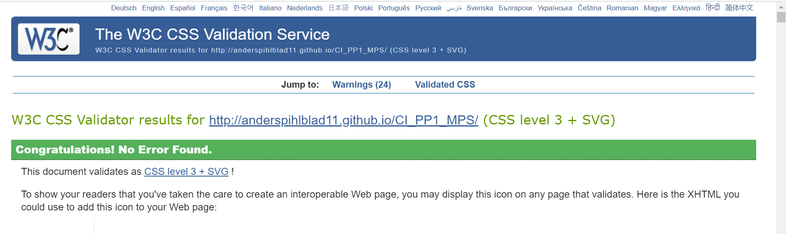

# Mapoma Safari
(Developer: Anders Pihlblad)

[Live webpage](http://anderspihlblad11.github.io/CI_PP1_MPS/)

## Table of Content

1. [Project Goals](#project-goals)
    1. [User Goals](#user-goals)
    2. [Site Owner Goals](#site-owner-goals)
2. [User Experience](#user-experience)
    1. [Target Audience](#target-audience)
    2. [User Requirements and Expectations](#user-requirements-and-expectations)
    3. [User Stories](#user-stories)
3. [Design](#design)
    1. [Design Choices](#design-choices)
    2. [Colour](#colours)
    3. [Fonts](#fonts)
    4. [Structure](#structure)
    5. [Wireframes](#wireframes)
4. [Technologies Used](#technologies-used)
    1. [Languages](#languages)
    2. [Frameworks & Tools](#frameworks-&-tools)
5. [Testing](#validation)
    1. [HTML Validation](#HTML-validation)
    2. [CSS Validation](#CSS-validation)
    3. [Performance](#performance)
    4. [Device testing](#performing-tests-on-various-devices)
5. [References](#references)

## Project Goals 

### User Goals
- Finding unique vaction destination.
- Having a clear view of what to expect.
- Have infomation about the Suites.
- Having a clear engaging story about the lodge.

### Site Owner Goals
- Have a luring story and theme.
- Clear visual representation of whats on offer.
- Clear and smooth website layout.
- Provide easy access for contact to customers.

## User Experience

### Target Audience
- People looking for a differnt vacation experience.
- Animal lovers.
- Tourists.

### User Requirements and Expectations

- Flowing and easy to understand layout.
- Good presentation and visually appealing regardless of screen size.
- Detailed description of what to expect.
- Authentic and professional feel to the website.
- Appealing and fun to go through.

### User Stories
1. As a user, I want to know what to expect.
2. As a user, I want to know the back story of the business.
3. As a user, I want to know the price range.
4. As a user, I want to view the accomodation.
5. As a user, I i want to know if i will be safe.

#### Site Owner 
6. As the site owner, I want users to have a good idea of what to expect.
7. As the site owner, I want users to experience what we have to offer through images.
8. As the site owner, I want the user to understand our vision and back story.
9. As the site owner, I would want a good logo.

## Design

### Design Choices
The webpage was designed to give the user the feeling of Adventure,comfort, style and luxury. The imagery gives the customer a great understanding of what is on offer and really has an inviting presence.

### Colour
For my color theme I didn't want to pack the web page with too many deep colors which in my view would make it look less profesional, so I stuck to a greenish type of theme which gives the feel of wilderness but calmness aswell. I got my color choice from Color Hunt.

### Fonts
The fonts I used were Roboto Condensed for the body and "Roboto Slab" for headings. I used Google fonts to extract both.

### Stucture
the is nothing out of the usual with my website. it carries the basic nav bar and logo, the home image is beautiful and sleek and adds great to the look as do all the other pictures and sections. My website consists of 5 pages all with a unique layout.

- Home page has the nav and logo then the main heading and picture, Suite,Activities and our story sections which have buttons which lead to each respective page and under that we have the footer which is present and stagnant in all pages. 

Home section 1

Home section 2

Home section 3

- Our story page had the nav and logo to start then a header and a text describing the origin story of the lodge and under thaty is a section with the images of the staff and under that is the footer.

Our story Section 1

Our story section 2

- Suite page has the nav and logo then a big heading and short descriptive text, it has sections with the different suites and a short description, pricing with buttons that lead the user to the book now page and under that we have the footer which is present and stagnant in all pages.

Suites section 1

Suites section 2

- Book now page has a beautiful back ground picture and a form on top of it with the a button that leads the user to the thank you page.

Book Now section 1

- Thank you page is what the user gets to after they have submitted their accomidation and dates.

Thank you page section 1

### Wireframes

Home

Our Story

Suites

Book Now

## Technologies Used

### Languages
- HTML
- CSS
- java Script

### Frameworks & Tools
- Git
- GitHub
- Gitpod
- Color Hunt
- Balsamiq
- Google Fonts
- VS code
- Font Awsome
- Canva

## Validation

### HTML Validation
The W3C Markup Validation Service was used to validate the HTML of the website. 

HTML

### CSS Validation
The W3C Jigsaw CSS Validation Service was used to validate the CSS of the website.

style.css

### Performance 
web.dev was used to test the performance of the website. 

Whole page

### Performing tests on various devices 
The website was tested on the following devices:
- lenovo laptop
- iphone 13
- iphone 5

### References
- Easy tutorials    (youtube)
- Slack student care
- Udemy
- My fellow student Ana
- My Mentor Mo 
- And my good friend Daniel

